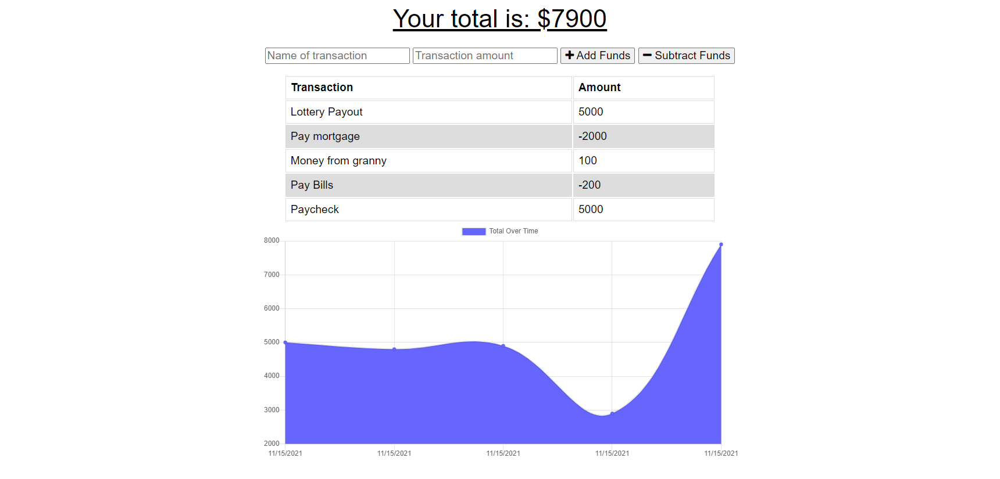

# PWA Demo: Online/Offline Budget Trackers

## Description

 > This app uses Mongoose, MongoDB, express.js, Node.js along with web manifest and service-worker.js to generate a budget tracker. The user will be able to add expenses and deposits to their budget with or without a connection. When entering transactions offline, they should populate the total when brought back online.

## Screenshot:
 

## License: 
 > 

## User Story
AS AN avid traveller
I WANT to be able to track my withdrawals and deposits with or without a data/internet connection
SO THAT my account balance is accurate when I am traveling

## Table of Contents:
- [Usage](https://github.com/chuck2076/PWA-Budget-Tracker#usage)
- [Deployed App](https://github.com/chuck2076/PWA-Budget-Tracker#deployed-app)
- [Tech Stack](https://github.com/chuck2076/PWA-Budget-Tracker#tech-stack)
- [Contributors](https://github.com/chuck2076/PWA-Budget-Tracker#contributors)
- [Questions](https://github.com/chuck2076/PWA-Budget-Tracker#questions)

## Usage

Giving users a fast and easy way to track their money is important, but allowing them to access that information anytime is even more important. Having offline functionality is paramount to our applications success.

GIVEN a user is on Budget App without an internet connection
WHEN the user inputs a withdrawal or deposit
THEN that will be shown on the page, and added to their transaction history when their connection is back online.

## Deployed App

> [Budget Tracker on Heroku](https://pwa-budget-tracker-crs.herokuapp.com/)

## Tech Stack:

 > * Node.js 
 > * Mongoose NPM
 > * MongoDB Atlas   
 > * Express.js
 > * JavaScript
 

## Contributors:
 > [https://github.com/chuck2076](https://github.com/chuck2076)

## Questions:
 Chuck Stephens 
 [https://github.com/chuck2076](https://github.com/chuck2076) 

Feel free to get in touch! 
 [chuckstephens2076@gmail.com](mailto:chuckstephens2076@gmail.com)